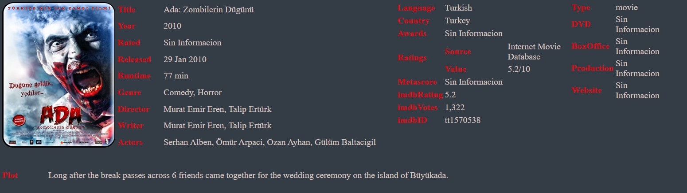

# Practica00-Consumo-de-APIs-en-la-nube

# TÍTULO PRÁCTICA: Desarrollo de una aplicación web utilizando la API de la base de datos de películas OMDB

## OBJETIVO ALCANZADO: Establecer un patrón arquitectónico, y desarrollar una aplicación web.

## ACTIVIDADES DESARROLLADAS
#### 1. Identificar gráficamente la arquitectura y el patrón de diseño de la aplicación a desarrollar.
#### 2. Generar una llave para consumir los servicios web de la API de OMDb.
#### 3. Crear un repositorio en GitHub con el nombre “Practica00 – Consumo de APIs en la nube”
#### 4. Desarrollar una aplicación con HTML + CSS + Javascript + Web Services para buscar películas y toda su información de la base de datos de OMDb.
#### 5. Realizar varios commits en la herramienta GitHub que demuestren el desarrollo de la aplicación.

# RESULTADO(S) OBTENIDO(S):

### 1.	Identificar gráficamente la arquitectura y el patrón de diseño de la aplicación a desarrollar.
La arquitectura implementada en esta aplicación es de cliente-servidor. La información atraviesa dos capas entre la interfaz y la administración de los datos.

### 4.1)	La aplicación Web debe permitir buscar la información de las películas tanto por el nombre (listado) como por el código (id) de cada película.

Función para obtener la URL. Condicional para retornar la URL para obtener los resultados por Título o ID.

Función donde transforma los datos que recoge de la URL entregada por la función anterior, los guarda en una variable de tipo String. Al recibir datos de un servidor web, los datos siempre son un String, con la función parse los datos se convierten en un objeto JavaScript.

### 4.2)	Además, se deberá visualizar toda la información disponible (plot=full) de la base de datos de películas.

Se muestra todos los detalles de la película según la ID. Si no dispone de información devuelve “Sin Información”

### 4.3)	También, la aplicación deberá presentar un máximo de 5 películas por búsqueda. Es decir, si la búsqueda retorna más de 5 películas se deberá paginar los resultados.

Bucle donde muestra toda la lista obtenida de JSON

### 4.4)	Por último, la interfaz gráfica de aplicada debe ser intuitiva y sencilla aplicando conceptos de experiencia de usuario (justificar en el informe).

# CONCLUSIONES:
Con el uso de las APIs se facilita la recuperación de datos sin necesidad de cargarlos en una pagina diferente sino de una forma eficaz, con el uso de Ajax la interacción del usuario se vuelve más intuitiva sin complicar la experiencia del usuario. 
RECOMENDACIONES: Realizar el funcionamiento de servicio web y y dejar al último el diseño de interfaz ya que eso no modifica el funcionamiento de la página web.

# RECOMENDACIONES: 
Realizar el funcionamiento de servicio web y y dejar al último el diseño de interfaz ya que eso no modifica el funcionamiento de la página web.